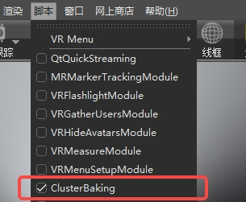

# ClusterBaking 集群烘焙
 ### 用于集群烘焙灯光阴影贴图的VRED插件
  #### 目前测试支持版本
 - VRED 2023.2 内部版本号15.2
 - VRED 2023.4 内部版本号15.4
 - 尚未测试 VRED 2024 版本
 - VRED 2023.0 版本不支持，API发生了更改
 #### 使用的VRED Python库
 - API V1
 - API V2
# 使用说明
### 打开插件
#### VRED菜单栏 -> 脚本 -> 勾选 Cluster Baking

### 创建任务
#### 左下角加号点击创建一个任务

### 远程启动
#### 打开远程启动选项卡，点击新增节点，创建集群节点
